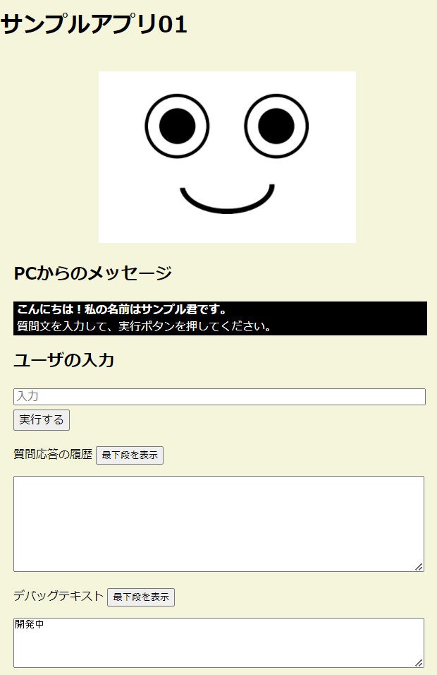
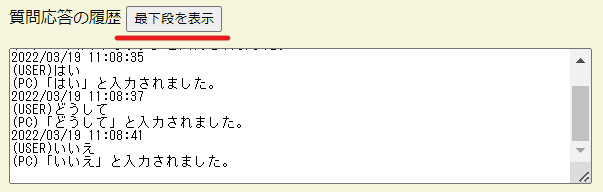

# Flask

---

適当なディレクトリに以下のようにファイルを配置してください。作業ディレクトリを`media2B_flask`とします。  
下記リストには動作に必要なファイルのみ示しています。

```cmd
media2B_flask
│ hello.py
│ sample01.py
├─static
│      common.css
│      happy.png
│      happy.wav
│      normal.png
│      normal.wav
│      sad.png
│      sad.wav
└─templates
        sample01.html
```

`media2B_flask`で`hello.py`を実行してください。

```cmd
>python3 hello.py
 * Serving Flask app 'hello' (lazy loading)
 * Environment: production
   WARNING: This is a development server. Do not use it in a production deployment.
   Use a production WSGI server instead.
 * Debug mode: on
 * Restarting with stat
 * Debugger is active!
 * Debugger PIN: 535-852-948
 * Running on all addresses.
   WARNING: This is a development server. Do not use it in a production deployment.
 * Running on http://192.168.XXX.XXX:5000/ (Press CTRL+C to quit)
```

Webブラウザで http://127.0.0.1:5000/ にアクセスしてください。ブラウザに`Hello World`の文字が表示されるはずです。

`python3 hello.py`を実行したターミナルで`Ctrl+C`キーによりプログラムを停止させてください。  
次に`sample01.py`を実行し、同じようにブラウザで http://127.0.0.1:5000/ にアクセスしてください。

```cmd
>python3 sample01.py
 * Serving Flask app 'sample01' (lazy loading)
 * Environment: production
   WARNING: This is a development server. Do not use it in a production deployment.
   Use a production WSGI server instead.
 * Debug mode: on
 * Restarting with stat
 * Debugger is active!
 * Debugger PIN: 535-852-948
 * Running on all addresses.
   WARNING: This is a development server. Do not use it in a production deployment.
 * Running on http://192.168.XXX.XXX:5000/ (Press CTRL+C to quit)
```

Webブラウザで http://127.0.0.1:5000/ にアクセスしてください。次の図のような画面が表示されるはずです。



何か文章を入力し「実行する」を押すと、サンプル君の表情がランダムに変化し入力された文字列をそのまま表示します。  
また、表情に対応した効果音が再生されます。  
ブラウザによっては音声再生に問題があるかもしれませんが、特に深刻になる必要はありません。

ユーザ入力とPCの応答履歴は「質問応答の履歴」に蓄積されます。  
履歴が増えてテキストエリアにスクロールバーが表示された状態で「最下段を表示」ボタンを押すと、テキストエリアが最下段までスクロールし最新の履歴が表示されます。



デバッグテキストのエリアは自由に使ってください。デバッグ用途に文字列出力することを意図しています。

---

[README](../README.md)
